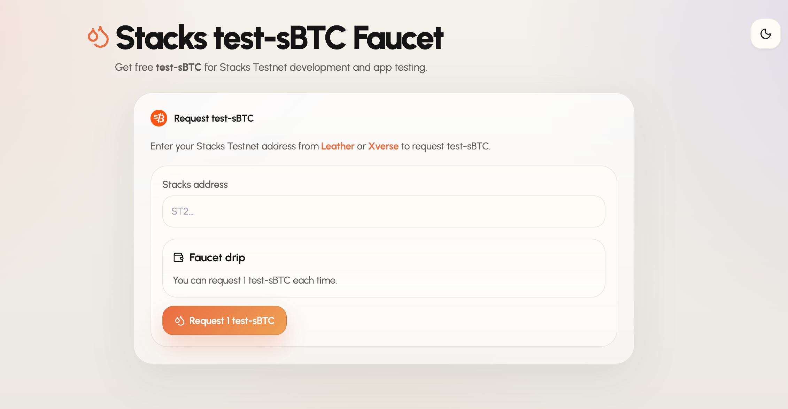
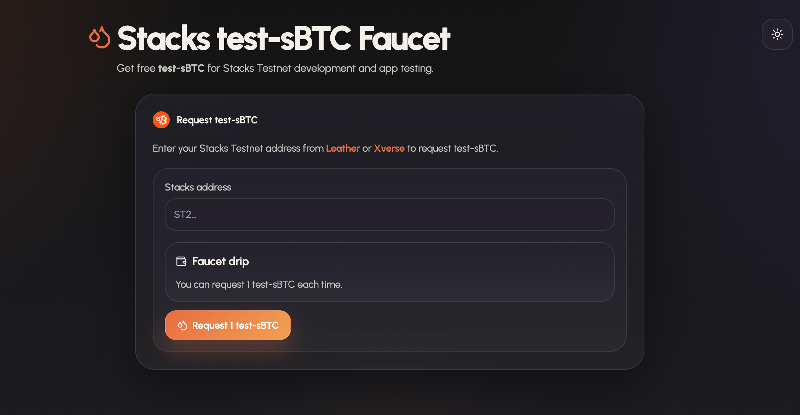

# test-sBTC Faucet

A lightweight Stacks testnet faucet UI for requesting `test-sBTC` from the `test-sbtc-faucet` Clarity contract in <a href="https://github.com/iamvon/test-sBTC-contract" target="_blank" rel="noreferrer">test-sBTC-contract</a>.

## Product Preview

<table>
  <tr>
    <td align="center" width="50%">
      
      <br />
      <sub>Light mode</sub>
    </td>
    <td align="center" width="50%">
      
      <br />
      <sub>Dark mode</sub>
    </td>
  </tr>
</table>

## Setup

1. Use Node `18.18+` or Node `20`
2. Copy `.env.example` to `.env.local`
3. Set `STACKS_FAUCET_MNEMONIC` or `STACKS_FAUCET_PRIVATE_KEY`
4. Install dependencies:

```bash
npm install
```

5. Run the app:

```bash
npm run dev
```

The UI and API routes run from the same Next.js app.

## MCP Server

This app also exposes a stateless MCP endpoint at `/api/mcp`.

Available MCP tools:

- `get_faucet_config`
- `validate_recipient`
- `request_test_sbtc`

Local test URL:

```text
http://localhost:3000/api/mcp
```

For GitBook, add this endpoint under the site or space `AI & MCP` settings as an external MCP server after the faucet app is deployed on a public HTTPS URL.

Example production URL:

```text
https://your-faucet-app.example.com/api/mcp
```

Important: the faucet currently has no rate limit or CAPTCHA. Do not expose `request_test_sbtc` publicly without abuse controls.

## Environment

- `STACKS_NETWORK`: `testnet` or `mainnet`
- `STACKS_NODE_URL`: Stacks API base URL
- `STACKS_CONTRACT_ADDRESS`: deployed contract address
- `STACKS_CONTRACT_NAME`: contract name
- `STACKS_FAUCET_MNEMONIC`: server-side faucet mnemonic
- `STACKS_FAUCET_PRIVATE_KEY`: optional alternative to mnemonic
- `FAUCET_UI_AMOUNT`: drip amount shown in the UI and sent on-chain

## Notes

- End users only enter a recipient address.
- The faucet signer remains server-side in Next route handlers.
- The API does a live read-only preflight before broadcasting.
- Never expose the faucet mnemonic through `NEXT_PUBLIC_*` variables.

## License

MIT
